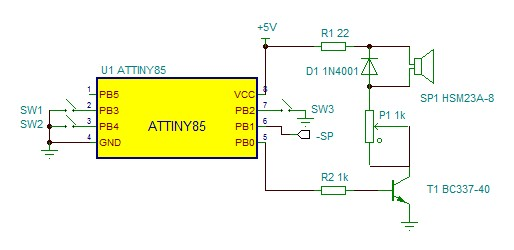

# AVR PC Beeper
Replace boring POST beep with Imperial March or Morrowind theme!

## Features
* 2 boards with integrated speaker, which play selected tune on boot
* 4 modes (controlled by 2 switches):
  * (0b00) - passthrough, POST beep is played as-is
  * (0b01) - Star Wars Imperial March
  * (0b10) - Morrowind theme (aka Nerevar Rising / Call of Magic)
  * (0b11) - Russian anthem
* Adjustable volume (blue potentiometer)

## Hardware
To detect POST signal AVR microcontroller reads motherboard speaker ground pin `-SP`.
I've created 2 devices in different form factors.
Both are based on `ATtiny85` microcontroller
(simply because I had these lying around, you may use a different one).

Schematic for both boards is mostly the same
(mini-ITX board doesn't have `SW3` switch):

### PCI board
Large board which plugs directly into PCI port.
Has an external panel, which exposes 2 toggle switches (`SW1` and `SW2`) and a potentiometer shaft (`P1`).
Note that when installed, back panel may be flipped. To select passthrough/tune
correctly, orient the panel so that volume shaft is the left side.

This board also has a dedicated dip switch (`SW3`) which disables POST trigger.
When this dip switch is ON, avr doesn't read motherboard speaker pin (`-SP`).
Instead, it plays selected tune once after being powered.
This means the tune may be played after waking from sleep mode.
This dip switch is ignored when passthrough is selected.

### Mini-ITX board
Tiny board, suitable for mini-ITX builds where space is at premium.
Tune/passthrough is selected with 2 on-board dip switches (`SW1` and `SW2`).
Unlike PCI build, there is no dip switch to disable POST trigger (`SW3`).
The board must be manually connected to a 5v power source with wires.

Pin order (top-down, board is positioned so that pins are on the left side):
1. `+5V` - power source, you can use speaker+ pin on the motherboard
2. `-SP` - trigger pin, connects to speaker- pin on the motherboard
3. `gnd` - you can use ground pin from any free port on the motherboard

Known issue: when volume is set above ~90%, the board may start playing satanic
screeches or otherwise behave strangely.

## Software

### How to build
Install required packages:

* `avr-gcc`
* `avr-libc`
* `avrdude`

Run `make` to build `.hex` file.

### How to flash
You can use any AVR ISP programmer supported by `avrdude`.
I am using Arduino as ISP,
to use other programmer modify `PROGR` variable in `Makefile`.

Connect the programmer and run `make flash PORT=<usbport>` to upload `.hex` file to AVR.
You may need superuser privileges,
for example when using Windows Subsystem for Linux:

`sudo make flash PORT=/dev/ttyS3`

## Revisions
* rev. 2 (current)
* [rev. 1](https://github.com/TheMozg/avr-pc-beeper/tree/rev.1) - first 2 boards, see corresponding branch

