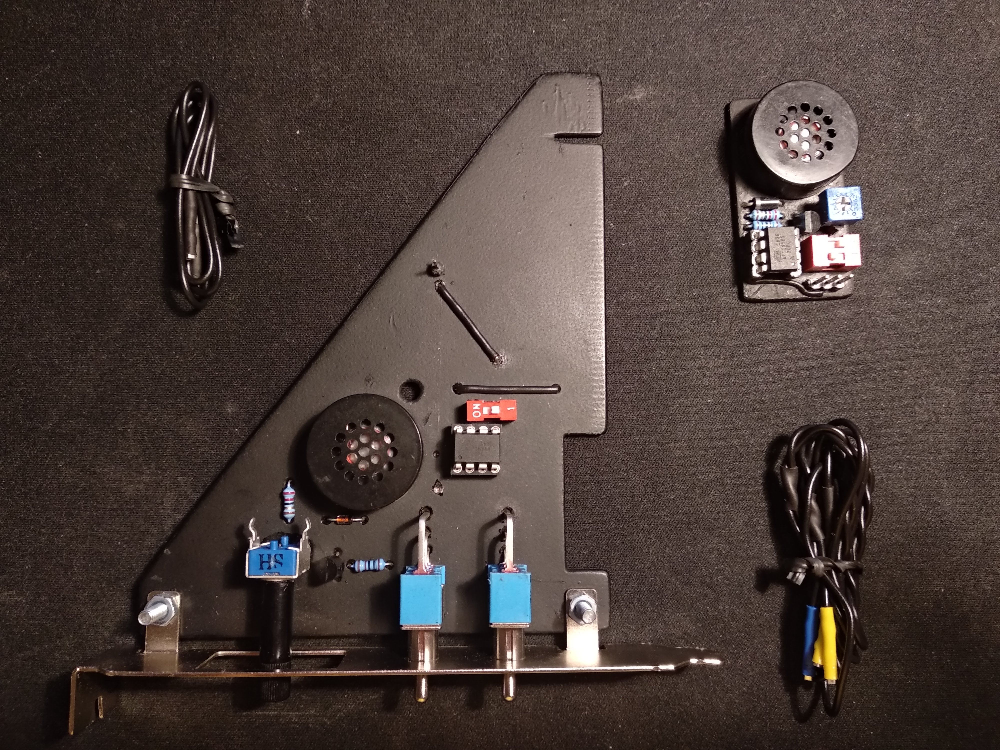

# AVR PC Beeper
Perfect contraption for loyal citizens of the Empire. Replace boring POST beep
with Imperial March.

# Hardware
PC beeper is connected to AVR instead of motherboard.
To detect POST signal AVR microcontroller reads motherboard speaker ground pin.
I've created 2 devices in different form factors.
Both are based on `ATtiny13A` microcontroller (simply because I had these lying around).

## 5v Molex build
Tiny board is powered by 4-pin Molex connector, 
suitable for mini-ITX builds where space is at a premium.

**Schematic:**

## 3.3v PCI Express build
This abomination is based on an old sound card,
and can be plugged into PCI-e port.

**Schematic:**

# Software

## Build
Install required packages:

* `avr-gcc`
* `avr-libc`
* `avrdude`

Run `make` to build `.hex` file.

## Flash
You can use any AVR ISP programmer supported by `avrdude`.
I am using Arduino as ISP, to use other programmer modify `PROGR` variable in `Makefile`.

Connect the programmer and run `make flash PORT=<usbport>` to upload `.hex` file to AVR.
You may need superuser privileges, for example when using Windows Subsystem for Linux:

`sudo make flash PORT=/dev/ttyS3` 
